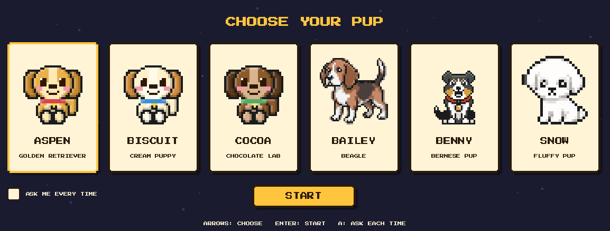
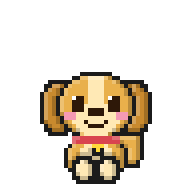
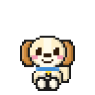
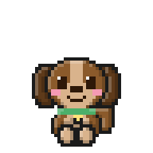
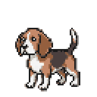
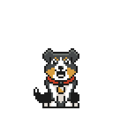
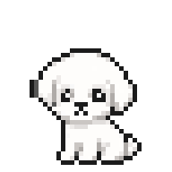
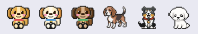
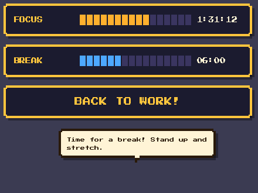

# 🐶 My-Woofie

**A digital companion that lives on your desktop and looks after you while you work.**

   

## Introduction

Long stretches at a screen are easy to lose track of. My-Woofie is a tiny pixel-art puppy who sits on top of your desktop, ambles after your cursor, and keeps quiet company while you work. After the focus time you choose (4 hours by default) he barks, shows a speech bubble and counts down a break. When the break is over, he calls you back with a gentle chime.

He is a companion first and a timer second: small, calm, a little silly, and easy to read, change and run locally. This is **Version 1** of the project.



## Meet the pups

Six dogs are part of My-Woofie. Pick yours on first launch, and change your mind any time from the right-click menu.

| | | |
|:---:|:---:|:---:|
| <br>**Aspen**<br>Golden retriever | <br>**Biscuit**<br>Cream puppy | <br>**Cocoa**<br>Chocolate lab |
| <br>**Bailey**<br>Beagle | <br>**Benny**<br>Bernese pup | <br>**Snow**<br>Fluffy white pup |

On your desktop every dog is exactly **53 × 47 pixels**, shown here at true size:



## What My-Woofie does

- **Stays small and calm.** Every dog is a fixed 53 × 47 pixels, roughly twice a mouse cursor, and moves slowly so he does not pull your attention.
- **Follows your cursor.** He wanders the screen edge when you are idle, and ambles toward the cursor while you move the mouse.
- **Uses a focus time you choose.** Set your own focus and break lengths (default 4 hours and 15 minutes) in the timer settings.
- **Tracks continuous use.** The focus timer resets only after 15 minutes without mouse movement, which means you really were away.
- **Nudges you to take a break.** At the limit he barks, shows a speech bubble and counts down the break on a retro game-style HUD, then calls you back with a soft chime.
- **Speaks in text when it is quiet.** Mute him and every alert appears as a speech bubble instead.
- **Rotates your own messages.** Edit `break_prompts.txt` and `focus_prompts.txt` to change what he says.
- **Lets you pick, switch or reset your dog.** Choose on first launch, tick "ask me every time" to choose at every start, or reset everything from the menu.
- **Is easy to stop.** Right-click and choose Quit, or run `python main.py --stop` from any terminal. You can also pause him.



## What My-Woofie does not do

- He does **not** capture your screen, log keystrokes, read your files or record window titles.
- He does **not** use the network. No accounts, analytics or cloud services.
- He does **not** lock your screen or block your input. He nudges; you decide.
- He does **not** know what you are doing. Presence comes only from elapsed time and mouse movement, so reading or typing without touching the mouse for 15 minutes counts as being away.
- He does **not** follow you across multiple monitors (primary screen only) or start automatically at login.
- He does **not** ship with recorded audio. The bark, howl and chime are synthesized; drop your own WAV files into `assets/audio/` to replace them.

## Quick start

Requirements: Python 3.9+ on Windows or macOS.

```bash
git clone https://github.com/aashnology/My-Woofie.git
cd My-Woofie
python -m venv venv
source venv/bin/activate        # Windows: venv\Scripts\activate
pip install -r requirements.txt
python main.py
```

On first launch you choose a pup and your focus and break times. After that he starts straight away.

| I want to... | Do this |
|---|---|
| Stop him | Right-click him, **Quit My-Woofie**. Or in any terminal: `python main.py --stop` |
| Choose a different dog | Right-click, **Change avatar...** (or `python main.py --select`) |
| Be asked every launch | Tick **ASK ME EVERY TIME** in the picker |
| Start over | Right-click, **Reset all settings...** (or `python main.py --reset`) |
| Change the focus time | Right-click, **Timer settings...** |
| See a full cycle quickly | `python main.py --test` (10 s focus, 5 s break; keep moving the mouse) |

All options: `--select`, `--reset`, `--settings`, `--stop`, `--test`, `--focus MIN`, `--break MIN`, `--version`.

## Customizing

- **Messages:** one per line in `break_prompts.txt` and `focus_prompts.txt` (lines starting with `#` are ignored). Changes apply without restarting.
- **Sounds:** replace the files in `assets/audio/`, or change `SOUND_EVENTS` in `config.py`.
- **Art:** animation frames live in `assets/images/<avatar>/`.
- **Everything else:** constants at the top of `config.py`.

## Tests

```bash
python -m unittest discover -s tests
```

## Documentation

- [User guide](docs/USER_GUIDE.md): everyday use, changing the focus time, resetting, turning him off, troubleshooting.
- [Technical guide](docs/TECHNICAL_GUIDE.md): how the code works (timers, state machine, rendering, audio, assets, configuration reference).
- [Changelog](CHANGELOG.md): what is in each version.

## License

Released under the [MIT License](LICENSE). © 2026 Aashna Batabyal.
